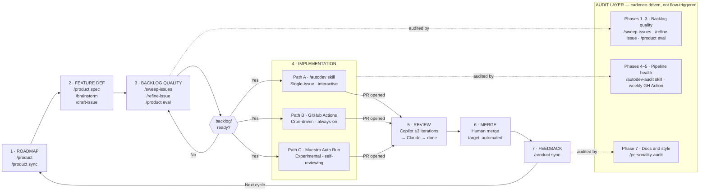

# mine — Product Development Lifecycle

> The authoritative map of how work flows from roadmap to shipped feature.

Seven sequential phases. Three parallel implementation paths. One cross-cutting audit
layer. Every skill and workflow maps to exactly one place in this diagram.

---

## Diagram



---

## Phase 1 — Roadmap

**What**: Strategic direction. Understand what the product needs next before any work starts.

**When to run**: At the start of any work session, before picking up new features, or
when the direction feels unclear. Also after a release cycle to reorient.

| Implementation | How to invoke | What it does |
|----------------|--------------|--------------|
| `/product` | Claude CLI skill | Full health check: phase gaps, vision drift, synergy map, ranked priorities |
| `/product sync` | Claude CLI skill | Reconcile VISION.md + STATUS.md with what's actually shipped |
| `/product spec` | Claude CLI skill | Draft a spec for the highest-value unspecced roadmap feature |

**Output**: Prioritized feature list, updated living docs, spec documents in
`docs/internal/specs/`.

**Gate to Phase 2**: A clear priority and (for complex features) a spec doc exists.

---

## Phase 2 — Feature Definition

**What**: Turn roadmap priorities into well-formed, implementation-ready GitHub issues.

**When to run**: After a `/product` health check surfaces priorities, or when a specific
idea needs to be captured.

| Implementation | How to invoke | What it does |
|----------------|--------------|--------------|
| `/product spec "idea"` | Claude CLI skill | Vision filter (identity, principle, phase, replacement tests) → spec if it passes → issue |
| `/product spec` | Claude CLI skill | Auto-picks highest-value unspecced feature → spec → issue |
| `/brainstorm [area]` | Claude CLI skill | Exploratory ideation in a focus area → ideas → selected idea → issue |
| `/draft-issue "idea"` | Claude CLI skill | Ad-hoc path: rough idea → iterative drafting → issue (no spec required) |

**Output**: GitHub issues with full template: summary, subcommands, architecture,
integration points, acceptance criteria, docs requirements.

**When to spec vs. draft**:
- New command, new domain, or cross-feature integration → `/product spec` first, then issue
- Small enhancement to an existing command → `/draft-issue` is sufficient

**Gate to Phase 3**: GitHub issue exists and is open.

---

## Phase 3 — Backlog Quality

**What**: Ensure every issue that enters the implementation queue is specific, correct,
and achievable. The `backlog/ready` label is the quality gate between discovery and building.

**When to run**: Before any implementation batch. After issues accumulate from Phase 2.

| Implementation | How to invoke | What it does |
|----------------|--------------|--------------|
| `/sweep-issues [label]` | Claude CLI skill | Scores all open issues on 10-item quality checklist. Labels: `backlog/needs-refinement` or suggests `backlog/ready` |
| `/refine-issue [N]` | Claude CLI skill | Interactive Q&A to fill gaps in a `backlog/needs-refinement` issue. Suggests `backlog/ready` when bar is met |
| `/product eval N` | Claude CLI skill | Vision + phase + principle fit check for a single issue. Output: READY / REFINE / DECLINE |

**Output**: Issues labeled `backlog/ready` with verified acceptance criteria, architecture
notes, and defined scope.

**Gate to Phase 4**: Issue has `backlog/ready` label.

---

## Phase 4 — Implementation

**What**: Build the feature. Three distinct paths — choose based on context.

**Gate in**: Issue has `backlog/ready` label.

### Path A — `/autodev` Skill

**What it is**: A Claude Code skill (`/autodev`) that implements a single issue in a
fresh worktree and opens a PR. Human-triggered, single-session.

**When to use**: Interactive implementation — you want to watch it happen, provide
guidance mid-flight, or implement a specific issue on demand.

```
/autodev         — auto-pick highest-value backlog/ready issue
/autodev 42      — implement specific issue #42
/autodev 42 "name"  — override branch name suffix
```

**Steps**: Fetch issue → create worktree → implement → `make test` + `make build` →
commit → open PR with verified acceptance criteria.

**Labels**: `via/autodev` on PR. Removes `agent/implementing` from issue via PR close.

### Path B — GitHub Actions Pipeline

**What it is**: An event-driven GitHub Actions pipeline with four workflows:
`autodev-dispatch` → `autodev-implement` → `autodev-review-fix` → `claude-code-review`.

**When to use**: Always-on background automation. Runs on a 4-hour cron without human
input. The production autonomous pipeline.

```
autodev-dispatch     — 4-hour cron (or manual trigger). Picks oldest backlog/ready
                       issue, labels agent/implementing, triggers implement.
autodev-implement    — Creates branch, runs agent, pushes, opens PR.
                       PR triggers CI + Copilot review.
autodev-review-fix   — Routes fixes by review phase (see Phase 5).
claude-code-review   — Triggered by agent/review-claude label or @claude mention.
```

**Labels**: `via/actions` on PR. Phase tracked in PR body HTML comment:
`<!-- autodev-state: {"phase": "copilot", "copilot_iterations": 0} -->`

### Path C — Maestro Auto Run

> **Note**: Maestro is experimental and not a production path. The two production
> implementation paths are `/autodev` (interactive) and GitHub Actions (always-on).

**What it is**: A Claude Code Auto Run playbook (`maestro/Backlog-Loop/`) that loops
through `backlog/ready` issues continuously. Supports multiple parallel instances via
label-based claiming and git worktree isolation.

**When to use**: Steady-state autonomous operation. Drain the backlog without human
involvement. Run multiple instances in parallel for higher throughput.

**9-step loop per issue**:
1. Pick issue (concurrency check, trust verify, claim with `via/maestro` + `agent/implementing` labels)
2. Plan implementation approach in fresh worktree
3. Implement with tests (`make test` + `make build`)
4. Open PR with full description
5. Wait for Copilot review + address feedback
6. Self-review with fresh-context subagent (up to 3 iterations)
7. Update docs + create follow-up issues
8. Finalize: label `human/review-merge`, clean up worktree
9. Progress check: more issues? Loop. Otherwise exit.

**Concurrency**: Max 3 open `via/maestro` PRs at once. Each instance claims different issues
via labels before other instances can see them.

**Labels**: `via/maestro`, `agent/implementing` on issue; `via/maestro` on PR; `human/review-merge` on done.

---

**All three paths converge here → PR is open.**

---

## Phase 5 — Review

**What**: Automated review iteration until the PR is approved and ready for human merge.

**Note**: Maestro PRs (Path C) arrive here having already completed a Copilot + self-review
cycle during implementation. They enter this phase at an already-higher quality bar.
`/autodev` and GitHub Actions PRs go through the full cycle below.

### Review Pipeline (GitHub Actions)

```
PR opened
    │
    ├── CI runs (make test + make build)
    │
    └── Copilot review posts
            │
    autodev-review-fix (phase: copilot)
            ├── Has comments + iteration < 3  → agent fixes → push → loop
            ├── Has comments + iteration >= 3 → transition to claude phase
            └── No comments                  → transition to claude phase
                        │
            autodev-review-fix adds label: agent/review-claude
                        │
            claude-code-review.yml triggers
                        │
    autodev-review-fix (phase: claude)
            └── Agent addresses feedback + creates follow-up issues for unresolved items
                        │
            Phase → done, completion comment posted
```

Copilot reviews iterate up to 3 times OR until Copilot has no actionable comments, whichever comes first. Then 1 Claude review pass. If at any point an agent fix fails, the PR is labeled `human/blocked`.

**Circuit breakers**:
- Copilot: max 3 fix iterations before escalating to Claude
- Claude: 1 final fix cycle
- Timeouts: 60 min implementation, 45 min review fixes
- Max turns: 100 for implementation, 50 for review fixes

**Gate to Phase 6**: Phase state is `done`. PR is approved or has completion comment.

---

## Phase 6 — Merge

**What**: Ship it.

**Current state**: Human reviews and merges. CODEOWNERS (`@rnwolfe`) reviews everything.

**Auto-merge criteria** (all must be true before enabling):

*Technical prerequisites*:
- Branch protection configured with required status checks
- GitHub auto-merge enabled on the repository
- `AUTODEV_TOKEN` PAT has merge permissions (or workaround for L-014)

*Per-PR gate conditions*:
- All required CI checks pass
- Review pipeline phase is `done` (autodev-state HTML comment)
- No `human/blocked` label present
- Origin is trusted (`via/autodev` or `via/actions`)
- Cooling period elapsed (30 min after last push, configurable)
- No unresolved review conversations

*Circuit breakers (require human merge even if gates pass)*:
- PR adds/modifies more than 500 lines
- Dependency changes (`go.mod`, `go.sum`)
- Security-sensitive files (`internal/env/`, encryption)
- Touches more than 10 files

**Until automated**: The human merge is the intentional quality gate. Review the PR,
check acceptance criteria verification in the PR body, merge.

**On merge**:
- Issue auto-closes via `Closes #N` / `Fixes #N` in PR body
- `agent/implementing` label removed
- Branch deleted

---

## Phase 7 — Feedback

**What**: Close the loop. Update the living docs so Phase 1 starts from accurate ground.

| Implementation | How to invoke | What it does |
|----------------|--------------|--------------|
| `/product sync` | Claude CLI skill | Reviews merged PRs, updates STATUS.md Done lists, updates VISION.md command map, commits |

**When to run**: After a release, after a batch of merges, or whenever STATUS.md feels stale.

**Output**: Committed updates to `docs/internal/STATUS.md` and `docs/internal/VISION.md`.

**Loop**: Feeds directly into Phase 1 (`/product` health check reads the updated docs).

---

## Audit Layer — Cross-Cutting

The audit layer runs on cadence, not triggered by the main pipeline. It evaluates the
*health of the process itself*, not individual features. Three domains:

### Backlog & Roadmap Quality (Phases 1–3)

| Implementation | How to invoke | Cadence | What it checks |
|----------------|--------------|---------|----------------|
| `/sweep-issues` | Claude CLI skill | Before each work batch | Open issue quality against 10-item checklist |
| `/refine-issue` | Claude CLI skill | After sweep flags gaps | Individual issue refinement via Q&A |
| `/product eval N` | Claude CLI skill | Ad-hoc | Single issue: vision, phase, principle fit |

### Pipeline Health (Phases 4–5)

| Implementation | How to invoke | Cadence | What it checks |
|----------------|--------------|---------|----------------|
| `/autodev-audit` | Claude CLI skill | Monthly or after 5–10 autodev PRs | PR quality, code pattern compliance, iteration stats |
| `autodev-audit` GH Action | GitHub Actions (manual or weekly cron Mon 9AM UTC) | Weekly | Same as skill but files report as GitHub issue labeled `report/pipeline-audit` |

### Docs & Style (Phase 7)

| Implementation | How to invoke | Cadence | What it checks |
|----------------|--------------|---------|----------------|
| `/personality-audit [area]` | Claude CLI skill | Before each release | CLI output, docs, site copy for tone drift from "whimsical but competent" voice |

---

## Quick Reference — "What do I run right now?"

| Situation | Phase | Run |
|-----------|-------|-----|
| Starting a new session, don't know what to do | 1 | `/product` |
| Living docs feel stale after merges | 1/7 | `/product sync` |
| Have a specific idea, want to know if it fits | 2 | `/product spec "idea"` |
| Want to spec the next obvious roadmap feature | 2 | `/product spec` |
| Have a quick enhancement to capture | 2 | `/draft-issue "idea"` |
| Want to explore a feature area loosely | 2 | `/brainstorm [area]` |
| Backlog has grown, preparing a work batch | 3 | `/sweep-issues` |
| An issue needs improvement | 3 | `/refine-issue N` |
| Checking if one issue is ready to build | 3 | `/product eval N` |
| Implement a specific issue, interactive | 4A | `/autodev N` |
| Let the background pipeline handle it | 4B | GitHub Actions (always running) |
| Drain backlog autonomously, hands-off | 4C | Start Maestro Auto Run (experimental) |
| Review cycle seems stuck | 5 | Check `autodev-review-fix` workflow logs |
| PR is done, ready to ship | 6 | Human merge |
| Post-release, update what shipped | 7 | `/product sync` |
| Backlog quality feels inconsistent | Audit | `/sweep-issues` |
| Pipeline feels slow or error-prone | Audit | `/autodev-audit` |
| CLI messages feel off-brand | Audit | `/personality-audit` |

---

## Skill → Phase Map

| Skill / Workflow | Layer | Phase |
|-----------------|-------|-------|
| `/product` | Main | 1 — Roadmap |
| `/product sync` | Main | 1/7 — Roadmap / Feedback |
| `/product spec` | Main | 1/2 — Roadmap / Feature Definition |
| `/product spec "idea"` | Main | 2 — Feature Definition |
| `/brainstorm` | Main | 2 — Feature Definition |
| `/draft-issue` | Main | 2 — Feature Definition |
| `/sweep-issues` | Main + Audit | 3 — Backlog Quality |
| `/refine-issue` | Main + Audit | 3 — Backlog Quality |
| `/product eval N` | Main + Audit | 3 — Backlog Quality |
| `/autodev` | Main | 4A — Implementation |
| GitHub Actions autodev pipeline | Main | 4B + 5 — Implementation + Review |
| Maestro Auto Run | Main | 4C — Implementation (experimental) |
| `autodev-review-fix` workflow | Main | 5 — Review |
| `claude-code-review` workflow | Main | 5 — Review |
| Human merge | Main | 6 — Merge |
| `/autodev-audit` | Audit | 4–5 — Pipeline health |
| `autodev-audit` GH Action | Audit | 4–5 — Pipeline health |
| `/personality-audit` | Audit | 7 — Docs & style |
