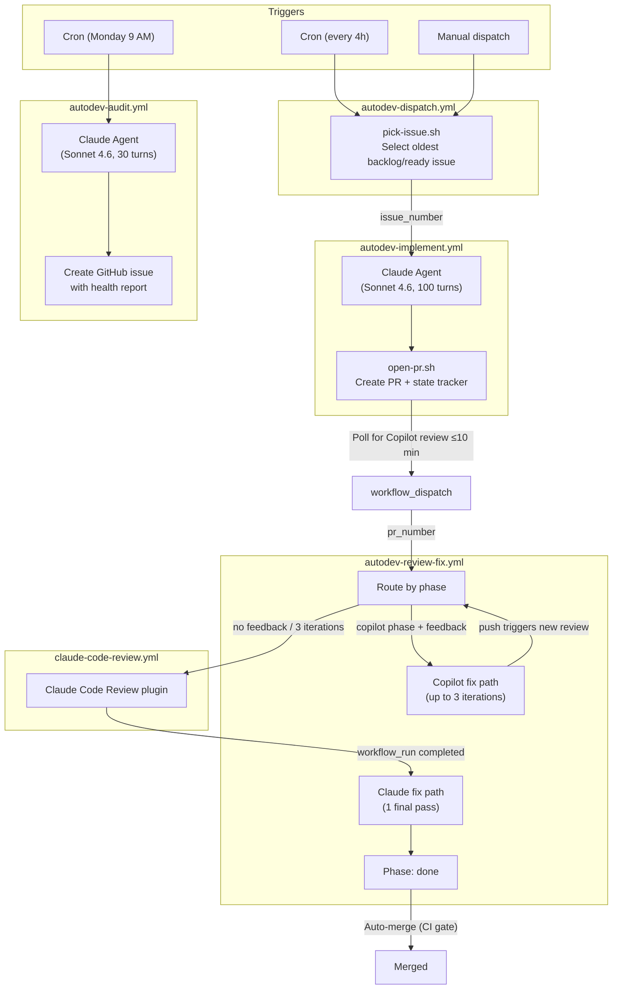
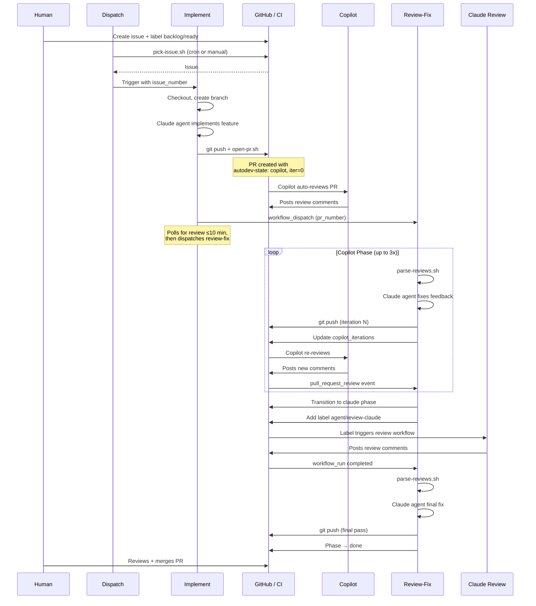
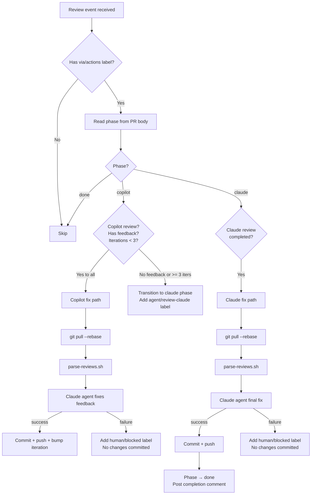
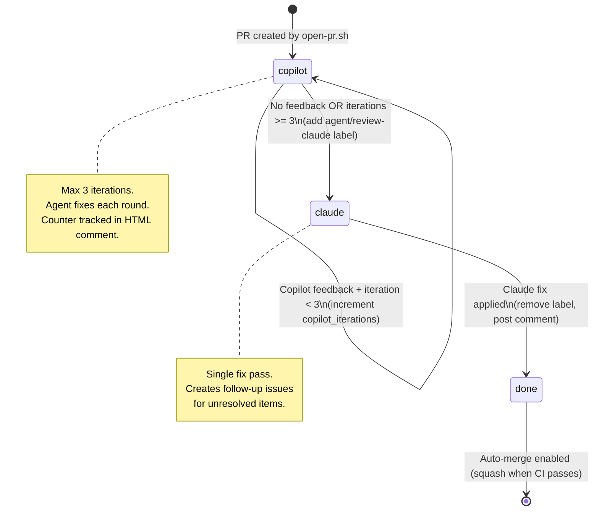

# Autonomous Development Pipeline — Deep Dive

The autodev pipeline is an event-driven GitHub Actions system that autonomously implements
GitHub issues end-to-end. A human creates an issue with acceptance criteria and labels it
`backlog/ready`; the pipeline picks it up, creates a branch, implements the feature, opens a
PR, iterates on reviewer feedback (Copilot then Claude), and stops at the final gate: human
merge. A weekly audit monitors pipeline health and files a report.

## Architecture Overview

Five workflows, six shell scripts, and one Claude Code skill form the system.



## Pipeline Lifecycle

A complete journey from issue creation to merged PR:



## Workflow Reference

### 1. autodev-dispatch

**File:** `.github/workflows/autodev-dispatch.yml`

| Property | Value |
|----------|-------|
| Triggers | Cron `0 */4 * * *` (every 4h) + manual dispatch |
| Timeout | Default |
| Concurrency | `autodev-dispatch` (serialized) |
| Permissions | contents:read, issues:write, actions:write |

**What it does:** Runs `pick-issue.sh` to find the oldest `backlog/ready` issue from a
trusted user, labels it `agent/implementing`, and dispatches `autodev-implement` with the issue
number. Exits cleanly if no issues are ready.

### 2. autodev-implement

**File:** `.github/workflows/autodev-implement.yml`

| Property | Value |
|----------|-------|
| Triggers | Workflow dispatch (from autodev-dispatch) |
| Input | `issue_number` (required) |
| Timeout | 60 minutes |
| Concurrency | `autodev-implement` (serialized globally) |
| Agent model | Claude Sonnet 4.6, 100 max turns |

**What it does:**
1. Reads the issue title and body via `gh issue view`
2. Creates branch: `autodev/issue-{N}-{slug}` (deletes stale remote if exists)
3. Runs Claude agent with implementation prompt (includes CLAUDE.md rules, doc instructions,
   PR description and title requirements)
4. Reverts any changes to protected files (CLAUDE.md, workflows, autodev scripts)
5. Commits, pushes, and calls `open-pr.sh` to create the PR
6. Polls for Copilot review (up to 10 minutes), then dispatches `autodev-review-fix`
   via `workflow_dispatch` with the PR number — bypasses `pull_request_review` trigger
   gating for bot actors on public repos
7. If no changes produced: comments on issue, adds `human/blocked` label

**Agent output files:**
- `/tmp/pr-title.txt` — conventional commit PR title (`type: description`)
- `/tmp/pr-description.md` — full PR body with summary, changes, criteria

### 3. autodev-review-fix

**File:** `.github/workflows/autodev-review-fix.yml`

| Property | Value |
|----------|-------|
| Triggers | `workflow_dispatch` (from implement), `pull_request_review` (human reviewers only), `workflow_run` (Claude review), cron `30 */4 * * *` (fallback) |
| Timeout | 45 minutes |
| Concurrency | Per-PR group (parallel review of different PRs) |
| Agent model | Claude Sonnet 4.6, 50 max turns |

**What it does:** Routes based on the phase stored in the PR body HTML comment.



**Key safety features:**
- Branch reconciliation (`git pull --rebase`) before each agent run
- Post-agent steps gated on `steps.<agent>.outcome == 'success'`
- Agent failure adds `human/blocked` label; no partial changes committed
- Protected files reverted after successful agent runs
- `pull_request_review` events from bot actors (`[bot]` suffix or login `claude`) are skipped
  immediately in the route script — bot phases have dedicated triggers (`workflow_dispatch`
  for copilot, `workflow_run` for claude) and allowing both paths to fire causes duplicate
  fix runs (see [L-020](lessons-learned.md#l-020-bot-review-events-cause-duplicate-review-fix-runs))

### 4. claude-code-review

**File:** `.github/workflows/claude-code-review.yml`

| Property | Value |
|----------|-------|
| Triggers | `agent/review-claude` label, `@claude` PR comment |
| Agent | Claude with `code-review` plugin |

**What it does:** Runs the Claude Code Review plugin which posts review comments on the PR.
When completed, the `workflow_run` event triggers `autodev-review-fix` to enter the claude
fix path.

### 5. autodev-audit

**File:** `.github/workflows/autodev-audit.yml`

| Property | Value |
|----------|-------|
| Triggers | Cron `0 9 * * 1` (Monday 9 AM UTC) + manual dispatch |
| Input | `limit` (default: 10 PRs to analyze) |
| Timeout | 30 minutes |
| Agent model | Claude Sonnet 4.6, 30 max turns |

**What it does:** Runs a Claude agent that analyzes recent autodev PRs (metrics, code
quality, review themes, stale state) and writes a report to `/tmp/audit-report.md`. The
workflow then creates a GitHub issue titled "Autodev Pipeline Audit — YYYY-MM-DD" with
label `report/pipeline-audit`. If the agent fails, a fallback issue links to the workflow logs.

## Phase State Machine

Review progress is tracked via an HTML comment in the PR body that survives edits and
is invisible to readers:

```html
<!-- autodev-state: {"phase": "copilot", "copilot_iterations": 0} -->
```



## Scripts & Helpers

All scripts live in `scripts/autodev/` and source `config.sh` for shared constants.

| Script | Purpose | Called by |
|--------|---------|----------|
| `config.sh` | Shared constants (repo, labels, limits, trusted users) + logging + `autodev_slugify()` | All scripts |
| `pick-issue.sh` | Select next `backlog/ready` issue; verify trusted labeler via timeline API; label `agent/implementing` | `autodev-dispatch` |
| `open-pr.sh` | Read agent-generated title/description; create PR with `via/actions` label + state tracker | `autodev-implement` |
| `parse-reviews.sh` | Extract review bodies + inline comments with `[comment_id: N]` tags for agent replies | `autodev-review-fix` |
| `check-gates.sh` | Verify quality gates (CI status, iteration count, no pending reviews, mergeable) | Available for local testing |
| `agent-exec.sh` | Local testing abstraction; routes to configured provider (`AUTODEV_PROVIDER`) | Local dev only |

## Security & Trust Model

### Trust verification

The `backlog/ready` label triggers the entire pipeline. Without verification, anyone who can
label an issue could queue arbitrary code generation. `pick-issue.sh` verifies the labeler:

1. Fetches the issue timeline via `gh api repos/{owner}/{repo}/issues/{N}/timeline`
2. Finds the last `labeled` event where `label.name == "backlog/ready"`
3. Checks `actor.login` against `AUTODEV_TRUSTED_USERS` in `config.sh`
4. Only proceeds if the labeler is trusted (see [L-017](lessons-learned.md#l-017-label-based-triggers-need-trust-verification))

### Protected files

Three revert steps (in `autodev-implement` and both paths of `autodev-review-fix`) prevent
the agent from modifying governance files:

```bash
git diff --name-only | grep -E '(CLAUDE\.md|\.github/workflows/|scripts/autodev/)' | xargs git checkout --
```

Files in `docs/internal/` (like `lessons-learned.md` and `key-files.md`) are intentionally
NOT protected — agents are encouraged to update them.

### Secret separation

| Secret | Purpose | Why not GITHUB_TOKEN? |
|--------|---------|----------------------|
| `GITHUB_TOKEN` | Read operations, issue comments, label edits | Default, sufficient for reads |
| `AUTODEV_TOKEN` (PAT) | Push branches, create PRs, edit PRs that trigger workflows | GITHUB_TOKEN events cannot trigger other workflows ([L-014](lessons-learned.md#l-014-github_token-cannot-trigger-downstream-workflows)) |
| `CLAUDE_CODE_OAUTH_TOKEN` | Authenticate Claude agent executions | Separate credential for AI provider |

## Configuration

### Labels

| Label | Applied by | Meaning |
|-------|-----------|---------|
| `backlog/ready` | Human | Issue is ready for autonomous implementation |
| `agent/implementing` | `pick-issue.sh` | Issue is being worked on |
| `via/actions` | `open-pr.sh` | PR was created by the pipeline |
| `human/blocked` | Workflow (on failure) | Pipeline hit a limit or error |
| `agent/review-claude` | `autodev-review-fix` | Copilot phase done, triggers Claude review |
| `report/pipeline-audit` | `autodev-audit` workflow | Weekly health report issue |

### Circuit breakers

| Breaker | Value | Purpose |
|---------|-------|---------|
| Implementation concurrency | Serialized via Actions group | One branch created at a time |
| Dispatch guard (open PRs) | Skip if any non-blocked `via/*` PR open | Prevents batch-merge conflicts when spec breaks feature into sub-issues ([L-024](lessons-learned.md#l-024-batch-merge-conflicts-from-spec-driven-sub-issue-bursts)) |
| Review-fix concurrency | Per-PR group | Multiple PRs reviewed in parallel |
| Copilot iterations | Max 3 | Prevents infinite fix loops |
| Claude fix passes | 1 | Final pass, creates follow-up issues for remainder |
| Implementation timeout | 60 min | Prevents runaway agent |
| Review-fix timeout | 45 min | Prevents runaway agent |
| Audit timeout | 30 min | Analysis only, no code changes |
| Implementation max turns | 100 | Prevents infinite agent loops |
| Review-fix max turns | 50 | Tighter limit for focused fixes |
| Audit max turns | 30 | Read-only analysis |
| Weekly audit | Monday 9 AM UTC | Pipeline health feedback loop |
| Implement → review-fix chain | Poll ≤10 min + dispatch | Primary trigger path; bypasses bot approval gate |
| Scheduled review poll | Every 4h (offset 30m) | Safety-net fallback for missed dispatches ([L-016](lessons-learned.md#l-016-bot-actors-trigger-github-actions-approval-gates)) |
| Bot-reviewer PR review filter | Skip `[bot]` / `claude` on `pull_request_review` | Prevents duplicate fix runs when bot reviews fire alongside `workflow_dispatch`/`workflow_run` ([L-020](lessons-learned.md#l-020-bot-review-events-cause-duplicate-review-fix-runs)) |

## Debugging Guide

### Agent failed, no changes committed

**Symptoms:** PR gets `human/blocked` label, comment says "No changes were committed."

**Diagnosis:**
1. Click the workflow logs link in the PR comment
2. Check the agent step output for error messages
3. Common causes: compilation error the agent couldn't fix, test flakiness, context limit

**Recovery:** Push a manual fix to the branch, or close the PR and re-label the issue.

### Branch divergence / rebase conflicts

**Symptoms:** "Branch reconciliation failed" error in review-fix.

**Diagnosis:** Another process pushed to the branch between checkout and agent execution.

**Recovery:** Manually rebase the branch: `git pull --rebase origin <branch> && git push --force-with-lease`.

### Stale agent/implementing issue with no PR

**Symptoms:** Issue stuck with `agent/implementing` label, no open PR.

**Diagnosis:** Implementation workflow failed before creating the PR (agent produced no
changes, or push failed).

**Recovery:** Remove `agent/implementing` label. If the issue is still valid, re-add `backlog/ready`.

### Copilot reviews not triggering review-fix

**Symptoms:** Copilot posts a review but `autodev-review-fix` never runs.

**Diagnosis:** The primary path is the implement → dispatch chain (polls for review up to
10 minutes, then dispatches `workflow_dispatch`). Note: `pull_request_review` events from
Copilot are intentionally filtered out by the route script (bot reviews are handled by
`workflow_dispatch`, not `pull_request_review`, to avoid duplicate runs —
[L-020](lessons-learned.md#l-020-bot-review-events-cause-duplicate-review-fix-runs)).
If the dispatch fails (e.g., no review appeared within 10 min, or implement timed out),
the 4-hour scheduled poll is the safety-net fallback.

**Recovery:** Manually dispatch `autodev-review-fix` with the PR number, or wait for the
scheduled poll.

### Wrong model or high costs

**Symptoms:** Pipeline costs are higher than expected.

**Diagnosis:** Check `claude_args` in each workflow for the `--model` flag.

**Current model:** `claude-sonnet-4-6` across all agent steps (implement: 100 turns,
review-fix: 50 turns, audit: 30 turns).

## Related Lessons Learned

These entries in [lessons-learned.md](lessons-learned.md) document hard-won pipeline knowledge:

| Entry | Topic |
|-------|-------|
| [L-013](lessons-learned.md#l-013-iteration-tracking-via-html-comments) | Iteration tracking via HTML comments |
| [L-014](lessons-learned.md#l-014-github_token-cannot-trigger-downstream-workflows) | GITHUB_TOKEN cannot trigger downstream workflows |
| [L-015](lessons-learned.md#l-015-copilot-review-state-is-commented-not-changes_requested) | Copilot review state is COMMENTED, not changes_requested |
| [L-016](lessons-learned.md#l-016-bot-actors-trigger-github-actions-approval-gates) | Bot actors trigger GitHub Actions approval gates |
| [L-017](lessons-learned.md#l-017-label-based-triggers-need-trust-verification) | Label-based triggers need trust verification |
| [L-020](lessons-learned.md#l-020-bot-review-events-cause-duplicate-review-fix-runs) | Bot review events cause duplicate review-fix runs |
| [L-021](lessons-learned.md#l-021-allowed_bots-must-include-claude-for-workflow_run-triggered-steps) | `allowed_bots` must include `claude` for `workflow_run`-triggered steps |

## Related Files

- [CLAUDE.md — Autonomous Development Workflow](../../CLAUDE.md#autonomous-development-workflow) — reference-level summary
- [lessons-learned.md](lessons-learned.md) — operational lessons (L-013 through L-017)
- [key-files.md](key-files.md) — file purpose index
- [autodev-audit skill](../../.claude/skills/autodev-audit/SKILL.md) — manual audit invocation
