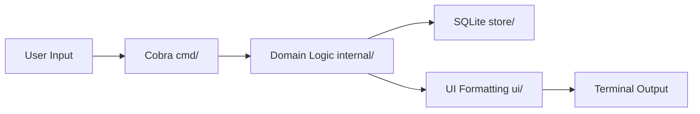
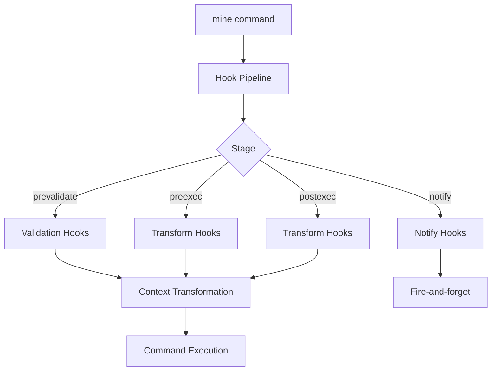

mine is a single Go binary built with Cobra (CLI), Lipgloss (styling), and SQLite (storage). It follows a clean domain separation pattern where each feature is an independent package under `internal/`.

## Directory Structure

```
mine/
├── main.go                  # Entry point — calls cmd.Execute()
├── cmd/                     # Command definitions (Cobra)
│   ├── root.go              # Dashboard, command registration
│   ├── init.go              # First-time setup
│   ├── todo.go              # Todo CRUD subcommands
│   ├── stash.go             # Dotfile management
│   ├── craft.go             # Project scaffolding
│   ├── dig.go               # Focus timer
│   ├── shell.go             # Shell completions & aliases
│   ├── config.go            # Config display
│   └── version.go           # Version info
├── internal/                # Domain logic (not exported)
│   ├── config/              # XDG config management
│   ├── store/               # SQLite database
│   ├── todo/                # Todo domain
│   ├── stash/               # Dotfile tracking
│   ├── craft/               # Project scaffolding
│   ├── hook/                # Plugin hook system
│   ├── plugin/              # Plugin lifecycle
│   ├── ui/                  # Terminal UI
│   └── version/             # Build metadata
├── docs/                    # Documentation
├── site/                    # This documentation site (Astro Starlight)
├── scripts/                 # Build & install helpers
├── .github/                 # CI/CD workflows
└── CLAUDE.md                # Project knowledge base
```

## Design Patterns

### 1. Thin Command Layer

Files in `cmd/` are orchestration only. They:
- Parse arguments and flags
- Call domain logic in `internal/`
- Format output using `internal/ui`

They do **not** contain business logic or direct database queries.

### 2. Domain Packages

Each feature owns its domain under `internal/`:
- `todo` owns the todo model, queries, and store interface
- `config` owns configuration loading and XDG path resolution
- `store` owns database connection, pragmas, and migrations
- `ui` owns all terminal styling and output formatting

Packages don't import each other unnecessarily. `store.DB` provides `*sql.DB` via `.Conn()`, and domain packages accept `*sql.DB` directly.

### 3. Progressive Migration

Schema changes are defined in `store.migrate()` and auto-applied on every `store.Open()`. This means:
- No migration CLI needed
- Database always matches expected schema
- New tables added with `CREATE TABLE IF NOT EXISTS`
- Safe for concurrent reads (WAL mode)

### 4. XDG Compliance

All file paths follow the [XDG Base Directory Specification](https://specifications.freedesktop.org/basedir-spec/latest/):

| Purpose | Path | Env Override |
|---------|------|-------------|
| Config | `~/.config/mine/` | `$XDG_CONFIG_HOME` |
| Data | `~/.local/share/mine/` | `$XDG_DATA_HOME` |
| Cache | `~/.cache/mine/` | `$XDG_CACHE_HOME` |
| State | `~/.local/state/mine/` | `$XDG_STATE_HOME` |

### 5. Consistent UI

All output goes through `internal/ui` helpers:
- `ui.Ok()`, `ui.Err()`, `ui.Warn()` — semantic messages
- `ui.Kv()` — key-value pairs with consistent padding
- `ui.Header()` — section headers
- `ui.Tip()` — contextual tips
- `ui.Greet()` — personality-infused greetings

Never use raw `fmt.Println` in commands.

## Data Flow



## SQLite Configuration

The database uses performance-optimized pragmas:
- `journal_mode=WAL` — concurrent reads, single writer
- `synchronous=NORMAL` — safe with WAL
- `cache_size=-64000` — 64MB in-memory cache
- `foreign_keys=ON` — referential integrity
- `temp_store=MEMORY` — temp tables in RAM
- `busy_timeout=5000` — 5s retry on lock contention

## Plugin System Architecture



The plugin system uses a four-stage hook pipeline:
1. **prevalidate** — validate and rewrite flags before parsing
2. **preexec** — transform context before execution
3. **postexec** — transform context after execution
4. **notify** — fire-and-forget side effects (logging, webhooks)

Plugins communicate via JSON-over-stdin. See [Plugin Protocol](/contributing/plugin-protocol) for details.

## Build System

- `make build` — builds with ldflags for version injection
- `make test` — runs the Go test suite with race detector
- `make cover` — generates coverage report
- GoReleaser handles cross-compilation for releases
- CI runs vet, test (with coverage), build, and smoke test
