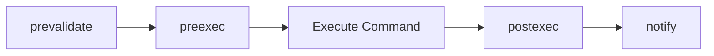

> Version: 1.0.0

This document defines the JSON communication contract between `mine` and plugin executables. Any language can implement a mine plugin — the only requirement is a binary that reads JSON from stdin and writes JSON to stdout.

## Protocol Version

Every invocation includes a `protocol_version` field. Plugins should check this field and fail gracefully if the major version is unsupported.

```json
"protocol_version": "1.0.0"
```

## Hook Invocation

When mine triggers a hook, it sends a **Context** object as JSON on the plugin's stdin:

```json
{
  "protocol_version": "1.0.0",
  "type": "hook",
  "stage": "preexec",
  "mode": "transform",
  "context": {
    "command": "todo.add",
    "args": ["buy milk"],
    "flags": {
      "priority": "high",
      "due": "tomorrow"
    },
    "result": null,
    "timestamp": "2026-01-15T10:30:00Z"
  }
}
```

### Transform Response

For `transform` mode hooks, the plugin writes a modified context to stdout:

```json
{
  "status": "ok",
  "context": {
    "command": "todo.add",
    "args": ["buy milk"],
    "flags": {
      "priority": "high",
      "due": "tomorrow",
      "tags": "groceries"
    },
    "result": null,
    "timestamp": "2026-01-15T10:30:00Z"
  }
}
```

### Notify Behavior

For `notify` mode hooks, mine does not read stdout. The plugin receives the context on stdin and performs side effects (logging, syncing, webhooks, etc.) without producing output. Notify hooks run concurrently and failures are logged but do not abort the command.

## Hook Pipeline

Commands traverse four hook stages:



| Stage | When | Mode | Purpose |
|-------|------|------|---------|
| `prevalidate` | Before arg parsing | `transform` | Modify args before validation |
| `preexec` | After validation, before execution | `transform` | Modify validated context |
| `postexec` | After execution, before output | `transform` | Modify result |
| `notify` | After output | `notify` | Fire-and-forget notifications |

## Command Invocation

Plugins can register custom commands. When a user runs a plugin command (e.g. `mine obsidian sync --vault notes`), mine invokes the plugin binary with:

```json
{
  "protocol_version": "1.0.0",
  "type": "command",
  "command": "sync",
  "args": ["--vault", "notes"]
}
```

`args` contains the raw, unparsed command-line arguments exactly as the user typed them. Flag parsing is the plugin's responsibility. The `flags` field is not populated for command invocations.

The plugin writes raw output to stdout (not JSON). This output is displayed directly to the user.

## Error Protocol

On error, plugins should exit with a non-zero status code and write a JSON error object to stderr:

```json
{
  "status": "error",
  "error": "vault not found at /path/to/vault",
  "code": "VAULT_NOT_FOUND"
}
```

If stderr is not valid JSON, mine displays the raw stderr text as the error message.

## Lifecycle Events

Plugins may optionally handle lifecycle events:

| Event | When | Expected Response |
|-------|------|-------------------|
| `init` | `mine` startup | None (fire-and-forget) |
| `shutdown` | `mine` exit | None (fire-and-forget) |
| `health` | `mine plugin info` | `{"status": "ok"}` |

```json
{
  "protocol_version": "1.0.0",
  "type": "lifecycle",
  "event": "health"
}
```

## Timeouts

| Mode | Default | Configurable |
|------|---------|--------------|
| Transform | 5s | Per-hook in manifest |
| Notify | 30s | Per-hook in manifest |
| Command | None | N/A |

If a plugin exceeds its timeout, mine kills the process and reports an error.

## Edge Cases

- **Malformed JSON response**: mine logs the raw output and reports a parse error
- **Plugin crash (non-zero exit, no stderr)**: mine reports "plugin exited unexpectedly"
- **Empty stdout for transform hook**: mine uses the original context unchanged
- **Plugin not executable**: mine reports a permission error with fix instructions
- **Plugin binary missing**: mine reports the plugin as broken, suggests reinstall

## Example: Transform Hook in Python

```python
#!/usr/bin/env python3
import json
import sys

def main():
    # Read input
    input_data = json.load(sys.stdin)

    # Validate protocol version
    if not input_data.get("protocol_version", "").startswith("1."):
        print(json.dumps({
            "status": "error",
            "error": "unsupported protocol version"
        }), file=sys.stderr)
        sys.exit(1)

    # Modify context
    context = input_data["context"]
    if "tags" not in context["flags"]:
        context["flags"]["tags"] = "auto-tagged"

    # Write response
    print(json.dumps({
        "status": "ok",
        "context": context
    }))

if __name__ == "__main__":
    main()
```

## Example: Notify Hook in Go

```go
package main

import (
	"encoding/json"
	"log"
	"os"
)

type Input struct {
	ProtocolVersion string `json:"protocol_version"`
	Type            string `json:"type"`
	Context         map[string]interface{} `json:"context"`
}

func main() {
	var input Input
	if err := json.NewDecoder(os.Stdin).Decode(&input); err != nil {
		log.Fatal(err)
	}

	// Perform side effect (e.g., log to file, send webhook)
	log.Printf("Command executed: %v", input.Context["command"])

	// No output required for notify hooks
}
```
